The Pioneer Press obtained a dataset from the Minnesota State Patrol of every speeding ticket issued from Jan. 1, 2013, through June 18, 2017. The dataset contains 224,915 different speeding tickets, coded for when and where the ticket was issued, how fast the motorist was going, and the motorist's age and gender.

This only includes tickets issued by the Minnesota State Patrol, and not those written by local governments.

Here's how the Pioneer Press used R code to process and analyze the data, and what we found:

``` r
# Load the data, and clean it up
speeding <- read.csv("speeding-raw.csv")
speeding$datetime <- mdy_hm(paste(speeding$stop_date,speeding$stop_time)) # Combine the date and time fields into a single datetime column
speeding$weekend <- ifelse(wday(speeding$datetime) %in% c(1,7), "Weekend","Weekday") # Create a binary variable for if the day is on a weekend
speeding$actual_speed <- as.numeric(speeding$actual_speed) # Convert the actual_speed column into nuneric form
speeding$decimaltime <- (hour(speeding$datetime) + minute(speeding$datetime)/60) %% 24 # Calculate time of day as a decimal number
speeding$milesover <- speeding$actual_speed - speeding$posted_speed # Compute miles over the posted limit
# Recode the violator_sex column from letters to words.
speeding$violator_sex <- str_replace_all(speeding$violator_sex, "M", "Male")
speeding$violator_sex <- str_replace_all(speeding$violator_sex, "F", "Female")
```

Big picture
-----------

The State Patrol has been getting busier. On average it writes around twice as many tickets per day as it did three years ago:

``` r
ggplot(speeding %>% group_by(date = date(speeding$datetime)) %>% summarize(tickets = n()), aes(date, tickets)) +
    geom_col(color = "grey35") + # Add columns
    geom_smooth() + # Add a smoothing bar
    theme_minimal() + # Set a minimalist theme
    # Label the graph
    labs(title = "Minnesota highway speeding tickets by day", # Title
         # Subtitle with the date range of the dataset
         subtitle = paste0( # Combine several different elements together
             strftime(min(speeding$datetime, na.rm = TRUE), format = "%b. %e, %Y"), # The earliest date in the data
             " - ", # A hyphen
             strftime(max(speeding$datetime, na.rm = TRUE), format = "%b. %e, %Y"), # The latest date in the data
             ". Source: Minnesota State Patrol" # A credit line
             ), # End the subtitle line
         caption = "Pioneer Press graphic by David H. Montgomery", # Caption
         x = "Date", # X-axis label
         y = "Speeding tickets per day") # Y-axis label
```

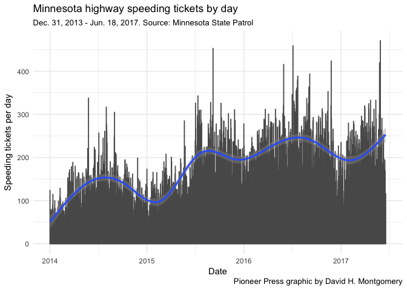

The trend is true for both male and female motorists:

``` r
ggplot(speeding %>% group_by(date = date(speeding$datetime), sex = violator_sex) %>% summarize(tickets = n()) %>% filter(sex != ""), aes(date, tickets, group = sex)) +
    geom_col(aes(fill = sex, color = sex), position = "stack") +
    geom_smooth(color = "black") +
    scale_fill_brewer("", type = "qual", palette = "Set1") +
    facet_wrap(~ sex) +
    theme_bw() +
    theme(legend.position = "none") +
    labs(title = "Minnesota highway speeding tickets by day and gender",
         subtitle = paste0(
             strftime(min(speeding$datetime, na.rm = TRUE), format = "%b. %e, %Y"),
             " - ",
             strftime(max(speeding$datetime, na.rm = TRUE), format = "%b. %e, %Y"),
             ". Source: Minnesota State Patrol"
             ),
         caption = "Pioneer Press graphic by David H. Montgomery",
         x = "Date",
         y = "Tickets")
```


2017 already has nearly as many total speeding tickets as 2014, and the year's not even half-done.

``` r
ggplot(speeding %>% group_by(year = year(datetime)) %>% summarize(tickets = n()), aes(year, tickets)) +
    geom_col() +
    scale_y_continuous(labels = comma) +
    theme_minimal() + 
    labs(title = "Speeding tickets per year by Minnesota State Patrol",
         subtitle = paste0(
             strftime(min(speeding$datetime, na.rm = TRUE), format = "%b. %e, %Y"),
             " - ",
             strftime(max(speeding$datetime, na.rm = TRUE), format = "%b. %e, %Y"),
             ". Source: Minnesota State Patrol"
             ),
         caption = "Pioneer Press graphic by David H. Montgomery",
         x = "",
         y = "Speeding tickets")
```


Summer peak
-----------

There are big peaks in speeding tickets around Memorial Day, the Fourth of July, and Labor Day. July as a whole is consistently busy. The rest of the year sees far fewer tickets written, though New Year's Day is an exception.

``` r
# Create a new data frame with speeding tickets grouped by month
speeding.months <- speeding %>% filter(violator_sex != "") %>% group_by(year = format(datetime, "%Y"), month = format(datetime, "%m")) %>% summarize(tickets = n(), avgover = mean(milesover, na.rm = T)) %>% mutate(yearmon = as_date(paste0(year,"-",month,"-01"))) %>% filter(yearmon != "2017-06-01")

colors = c(rep("blue",2), rep("darkgreen", 3), rep("darkred", 3), rep("darkorange", 3), "blue") # Create a color scale for our graph
# Plot the data
ggplot(speeding.months, aes(yearmon, tickets, fill = month)) +
    geom_col() +
    scale_fill_manual(values = colors) + # Apply out color scale
    scale_y_continuous(labels = comma) +
    scale_x_date(date_breaks = "3 months", date_labels = "%b. %y") +
    theme_minimal() +
    theme(legend.position = "none") +
    labs(title = "Speeding tickets issued by month on Minnesota highways",
         subtitle = paste0(
             strftime(min(speeding$datetime, na.rm = TRUE), format = "%b. %e, %Y"),
             " - ",
             strftime(max(speeding$datetime, na.rm = TRUE), format = "%b. %e, %Y"),
             ". Source: Minnesota State Patrol. Colors reflect seasons."
             ),
         caption = "Pioneer Press graphic by David H. Montgomery",
         x = "Month",
         y = "Speeding tickets issued")
```

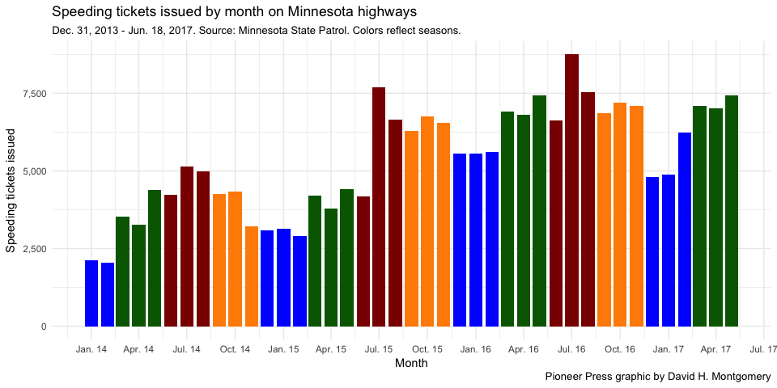

``` r
speeding.days <- speeding %>% filter(year(datetime) != "2017") %>% group_by(day = yday(datetime)) %>% summarize(tickets = n()) %>% mutate(date = as.Date(paste("2016", day), format = "%Y %j"))
ggplot(speeding.days, aes(date, tickets)) +
    geom_col(color = "grey35") +
    geom_smooth() +
    theme_minimal() +
    scale_fill_brewer("", type = "qual", palette = "Set1") +
    scale_x_date(date_breaks = "2 months", date_labels = "%b") +
    #facet_wrap(~ sex) +
    labs(title = "Minnesota highway speeding tickets by day of the year",
         subtitle = paste0(
             strftime(min(speeding$datetime, na.rm = TRUE), format = "%b. %e, %Y"),
             " - ",
             strftime(max(speeding.days$date, na.rm = TRUE), format = "%b. %e, %Y"),
             ". Source: Minnesota State Patrol"
             ),
         caption = "Pioneer Press graphic by David H. Montgomery",
         x = "Day of the year, 2013-2016",
         y = "Tickets")
```

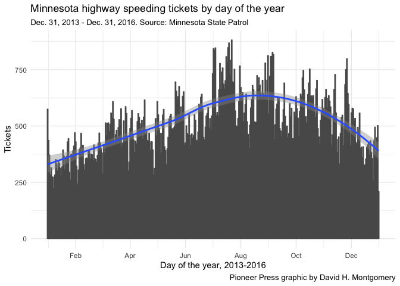

You're actually more likely to get a ticket on a weekend than a weekday.

``` r
ggplot(speeding %>% filter(!is.na(datetime)) %>% group_by(weekday = wday(datetime, label = TRUE)) %>% summarize(tickets = n()),
       aes(weekday, tickets)) +
    geom_col() +
    theme_minimal() +
    scale_y_continuous("Tickets", labels = comma) +
    labs(title = "Minnesota highway speeding tickets by day of week",
         subtitle = paste0(
             strftime(min(speeding$datetime, na.rm = TRUE), format = "%b. %e, %Y"),
             " - ",
             strftime(max(speeding$datetime, na.rm = TRUE), format = "%b. %e, %Y"),
             ". Source: Minnesota State Patrol"
             ),
         caption = "Pioneer Press graphic by David H. Montgomery",
         x= "")
```


Despite this difference, it doesn't appear that speeding tickets are given out in different places on weekends vs. weekdays. Nor does this change in the summer vs. the rest of the year. (It's not the case, for example, that outstate tickets go up on summer weekends as metro residents head to the cabin.)

``` r
ggplot(speeding %>% mutate(metro = ifelse(violation_county %in% c("HENNEPIN", "RAMSEY", "DAKOTA", "ANOKA", "SCOTT", "WASHINGTON", "CARVER"), "Metro", "Outstate"), summer = ifelse(month(datetime) %in% c(6:8), "Summer", "Not summer")) %>% group_by(metro, weekend, summer) %>% summarize(tickets = n()) %>% group_by(weekend, summer) %>% mutate(pct = tickets/sum(tickets)), aes(metro, pct, group = metro)) +
    geom_col() +
    scale_y_continuous(labels = percent) +
    theme_bw() +
    scale_fill_brewer("Location of ticket", type = "qual", palette = "Dark2", labels = c("Metro", "Outstate")) +
    facet_grid(summer ~ weekend) +
    labs(title = "Location of Minnesota State Patrol speeding tickets on weekends & weekdays",
         subtitle = paste0(
             strftime(min(speeding$datetime), format = "%b. %e, %Y"),
             " - ",
             strftime(max(speeding$datetime), format = "%b. %e, %Y"),
             ". Source: Minnesota State Patrol"
             ),
         caption = "Pioneer Press graphic by David H. Montgomery",
         x = "Location",
         y = "Share of speeding tickets")
```

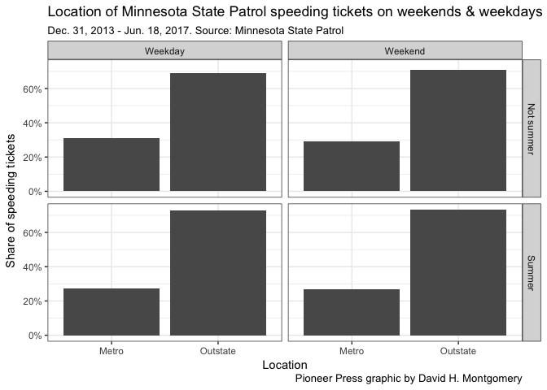

Time
----

Most tickets are written during the daytime hours, whether it's a weekend or a weekday.

The difference is that on weekdays, tickets spike in the 7 a.m. hour and 9 a.m. hour and reach a peak in the mid-afternoon, between 2 p.m. and 3 p.m. On weekends, tickets rise gradually through the morning until the 10 a.m. hour, trail off over lunch, then climb to reach a peak between 4 p.m. and 6 p.m.

``` r
ggplot(speeding %>% group_by(hour = floor(decimaltime), weekend) %>% summarize(tickets = n()) %>% ungroup() %>% group_by(weekend) %>% mutate(ticketsper = tickets/sum(tickets)), aes(hour, ticketsper)) +
    geom_col() +
    scale_y_continuous(labels = percent) +
    scale_x_continuous(breaks = c(0, 4, 8, 12, 16, 20, 24), labels = c("Midnight", "4 a.m.", "8 a.m.", "Noon", "4 p.m.","8 p.m.","")) +
    facet_wrap(~ weekend) +
    theme_bw() +
    labs(title = "What time of day are people ticketed on Minnesota highways?",
         subtitle = paste0(
             strftime(min(speeding$datetime), format = "%b. %e, %Y"),
             " - ",
             strftime(max(speeding$datetime), format = "%b. %e, %Y"),
             ". Source: Minnesota State Patrol"
             ),
         caption = "Pioneer Press graphic by David H. Montgomery",
         x = "Hour of the day", 
         y = "Percent of tickets written")
```

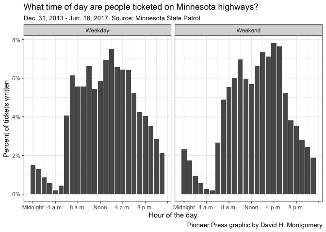

Does the gender of the driver have an impact on when people are pulled over?

``` r
ggplot(speeding %>% filter(violator_sex != "") %>% group_by(hour = floor(decimaltime), weekend, sex = violator_sex) %>% summarize(tickets = n()), aes(hour, tickets, fill = sex)) +
    geom_col() +
    scale_y_continuous(labels = comma) +
    scale_x_continuous(breaks = c(0, 4, 8, 12, 16, 20, 24), labels = c("Midnight", "4 a.m.", "8 a.m.", "Noon", "4 p.m.","8 p.m.","")) +
    facet_grid(sex ~ weekend) +
    #geom_smooth(method = "loess") +
    theme_bw() +
    theme(legend.position = "none") +
    labs(title = "What time of day are men and women ticketed on Minnesota highways?",
         subtitle = paste0(
             strftime(min(speeding$datetime), format = "%b. %e, %Y"),
             " - ",
             strftime(max(speeding$datetime), format = "%b. %e, %Y"),
             ". Source: Minnesota State Patrol"
             ),
         caption = "Pioneer Press graphic by David H. Montgomery",
         x = "Hour of the day", 
         y = "Tickets written")
```

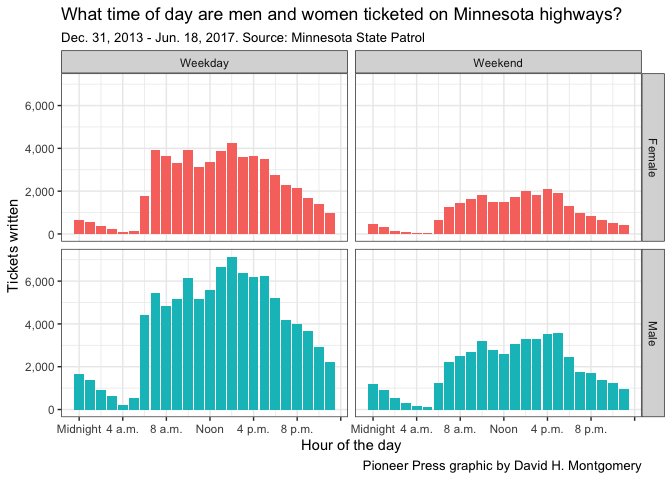

Doesn't seem like it.

Speed
-----

How fast are people who get ticketed for speeding usually going? It turns out the rule of thumb about it being safe to go up to 5 mph over the speed limit has something to it: only 37 out of more than 223,000 speeding tickets in the State Patrol's database were for fewer than 5 mph over the post speed limit, or just over one-tenth of one percent.

Even going 10 mph over only rarely gets drivers in trouble. Just 3.1 percent of tickets were for speeds 10 mph over the limit or less.

The average ticket was for drivers going 16 mph faster than they should have. But the most common ticket was for 12 mph above the posted limit. More than 25 percent of all tickets were for that speed.

(Note: the data contains 1,258 rows where the actual speed is *less* than the posted speed, usually by a lot. These are all speeding violations, so I'm assuming these are typos. Many list single-digit actual-speeds.)

``` r
ggplot(speeding %>% filter(milesover >= 0), aes(milesover)) +
    #geom_histogram(breaks = seq(from = 0, to = 40, by = 1)) + 
    geom_bar(aes(y = (..count..)/sum(..count..))) +
    scale_y_continuous("Percent of speeding tickets", labels = percent, limits = c(0,0.3)) +
    scale_x_continuous(limits = c(0,40), breaks = seq(0, 40, by = 5)) +
    theme_minimal() +
    labs(title = "How fast are Minnesota highway speeders going?",
         subtitle = paste0(
             strftime(min(speeding$datetime), format = "%b. %e, %Y"),
             " - ",
             strftime(max(speeding$datetime), format = "%b. %e, %Y"),
             ". Source: Minnesota State Patrol"
             ),
         caption = "Pioneer Press graphic by David H. Montgomery",
         x = "Miles over the posted speed limit")
```

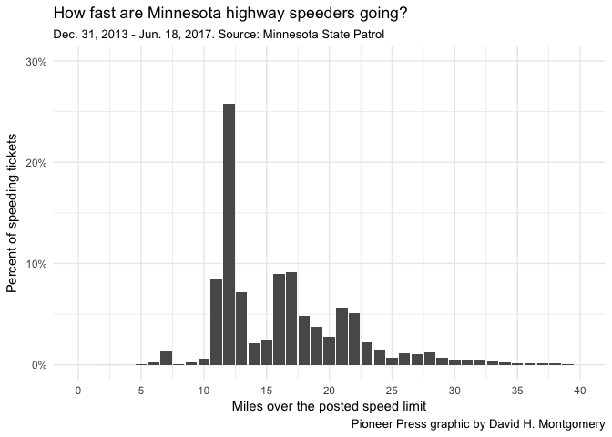

Age
---

Young drivers get a disproportionate amount of speeding tickets. The State Patrol wrote 11 percent of all their tickets to teenage drivers, and one-third to drivers 25 and under.

The youngest drivers to get ticketed were 14. The oldest was a 103-year-old going 76 mph in a 55 mph zone in Lake County.

The age distribution hasn't changed over the time period in question.

``` r
ggplot(speeding %>% filter(violator_sex != "", AGE >= 10) %>% group_by(violator_sex, AGE) %>% summarize(tickets = n()) %>% mutate(pct = tickets/sum(tickets)), aes(AGE, tickets, group = violator_sex, fill = violator_sex, color = violator_sex)) +
    geom_col() +
    scale_y_continuous(labels = comma) +
    scale_x_continuous(position = "top", limits = c(10,103), breaks = seq(10,100, by = 10)) +
    facet_wrap(~ violator_sex, strip.position = "bottom") +
    theme_bw() +
    theme(legend.position = "none") +
    labs(title = "Minnesota State Patrol speeding tickets by age and gender",
         subtitle = paste0(
             strftime(min(speeding$datetime), format = "%b. %e, %Y"),
             " - ",
             strftime(max(speeding$datetime), format = "%b. %e, %Y"),
             ". Source: Minnesota State Patrol"
             ),
         caption = "Pioneer Press graphic by David H. Montgomery",
         x = "Age",
         y = "Speeding tickets")
```

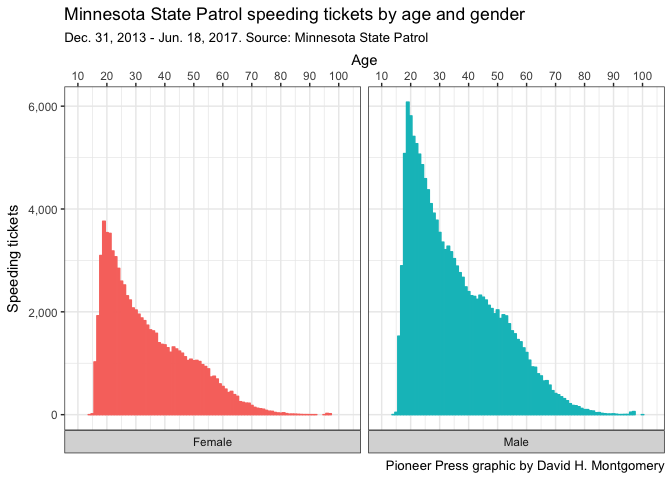

So why are younger drivers ticketed more? There may be many answers, but one is simple: they drive faster.

The typical 15-year-old given a speeding ticket by the State Patrol was going an average of 19.2 mph over the posted limit. This fell to 16.9 mph over for 25-year-olds, 16.1 mph for 35-year-olds, and 15.2 mph for 55-year-olds.

``` r
ggplot(speeding %>% filter(violator_sex != "", AGE >= 10, milesover >= 0) %>% group_by(AGE) %>% summarize(avg = mean(milesover)), aes(AGE, avg)) +
    geom_point() +
    theme_minimal() +
    scale_x_continuous(limits = c(15, 100), breaks= seq(15, 105, by = 10)) +
    #expand_limits(y= 0) +
    labs(title = "Average mph over speed limit by age of driver on Minnesota highways",
         subtitle = paste0(
             strftime(min(speeding$datetime), format = "%b. %e, %Y"),
             " - ",
             strftime(max(speeding$datetime), format = "%b. %e, %Y"),
             ". Source: Minnesota State Patrol"
             ),
         caption = "Pioneer Press graphic by David H. Montgomery",
         x = "Age",
         y = "Average mph over speed limit")
```

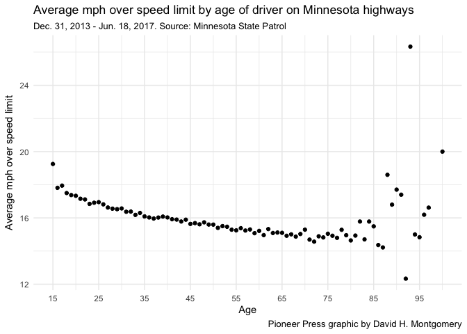

Speeding by speed limit
-----------------------

In most speed zones, we see similar patterns in how fast speeders are exceeding the limit in different speed zones.

Whether the speed limit is 55 mph, 60 mph, 65 mph or 70 mph, almost no tickets are written for less than 10 mph over the limit. The most tickets are issued for about 12 mph over. There's another spike at around 16 or 17 mph over, and another at around 22 or 23 mph over.

In one odd occurrencem in the entire 3.5-year time period of the dataset, no one has been ticketed for going 80 mph in a 60 mph zone.

``` r
ggplot(speeding %>% filter(posted_speed %in% c(55, 60, 65, 70), milesover >= 0), aes(milesover)) +
    geom_histogram(binwidth = 1) +
    facet_wrap(~ posted_speed, scales = "free_y") +
    scale_y_continuous(labels = comma) +
    theme_bw() +
    labs(title = "How fast are speeders going in different speed limits?",
         subtitle = paste0(
             strftime(min(speeding$datetime), format = "%b. %e, %Y"),
             " - ",
             strftime(max(speeding$datetime), format = "%b. %e, %Y"),
             ". Source: Minnesota State Patrol"
             ),
         caption = "Pioneer Press graphic by David H. Montgomery",
         x = "Miles over posted speed limit",
         x = "Number of tickets")
```

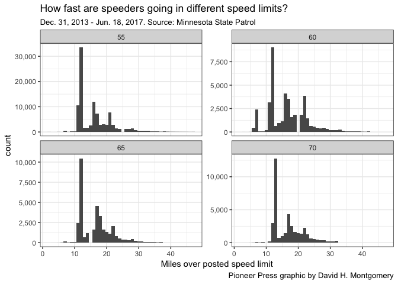

The "practice freeway"
----------------------

The one exception to that general trend is one East Metro residents are intimately familiar with: the stretch of Interstate 35E to the south of downtown St. Paul which has a 45 mph speed limit. The lower limit, the result of a compromise when the highway was built, is frequently challenged by commuters unhappy with the slower pace — and the lower speeding ticket threshold.

So how aggressive is the State Patrol at enforcing this lower limit? Pretty aggressive. Out of 1,003 speeding tickets written on the 45 mph section of 35E since 2013, 194 of them would have been legal with a 55 mph speed limit:

``` r
i35e <- speeding %>% filter(violation_county == "RAMSEY", posted_speed == 45, str_detect(location_description, "35E"))
ggplot(i35e, aes(actual_speed)) +
    geom_histogram(binwidth = 1, center = .5) +
    scale_x_continuous(breaks = c(45, 55, 65, 75, 85, 95, 105)) +
    geom_vline(xintercept = 55, color = "blue") +
    theme_minimal() +
    labs(title = "Cited speeds for speeding tickets on 45 mph section of Interstate 35E",
         subtitle = paste0(
             strftime(min(speeding$datetime), format = "%b. %e, %Y"),
             " - ",
             strftime(max(speeding$datetime), format = "%b. %e, %Y"),
             ". Source: Minnesota State Patrol"
             ),
         caption = "Pioneer Press graphic by David H. Montgomery",
         x = "Cited speed (mph)",
         y = "Numer of tickets")
```

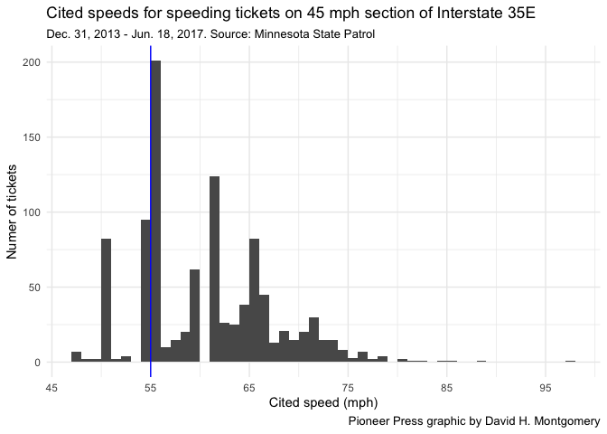

That's 19.3 percent of tickets on this freeway for 10 mph over the limit or less. By contrast, remember, just 3.1 percent of statewide tickets were for 10 mph over or less. That means drivers on the 45 mph section of I-35E are more than six times likely to get a ticker for going less than 10 mph over than the state average.

A full 71 percent of the tickets on the "practice freeway" are for drivers going 65 mph or less. Only 1.3 percent of tickets on the Ramsey County portion of Interstate 94 (with a 55 mph limit) were for drivers going that slow.

``` r
# Create a dataset with only Ramsey County sections of I-94 with 55 mph speed limits
i94 <- speeding %>% filter(violation_county == "RAMSEY", posted_speed == 55, str_detect(location_description, " 94"), actual_speed >= 45)
ggplot(i94, aes(actual_speed)) +
    geom_histogram(binwidth = 1, center = .5) +
    scale_x_continuous(limits = c(45, 105), breaks = c(45, 55, 65, 75, 85, 95, 105)) +
    scale_y_continuous(labels = comma) +
    theme_minimal() +
    labs(title = "Cited speeds for speeding tickets on Interstate 94 in Ramsey County",
         subtitle = paste0(
             strftime(min(speeding$datetime), format = "%b. %e, %Y"),
             " - ",
             strftime(max(speeding$datetime), format = "%b. %e, %Y"),
             ". Source: Minnesota State Patrol"
             ),
         caption = "Pioneer Press graphic by David H. Montgomery",
         x = "Cited speed (mph)",
         y = "Numer of tickets")
```

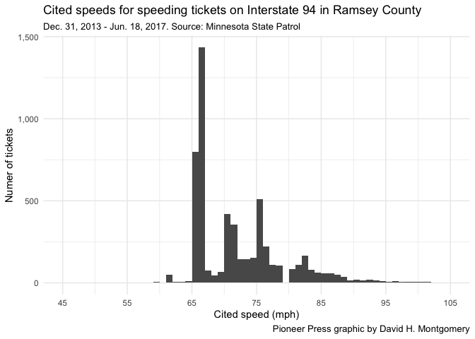

More than half the tickets were for less than 60 mph, a speed that would have been just 5 mph over; almost no speeding tickets are written for that amount of speeding statewide.

Place
-----

The State Patrol has issued speeding tickets in all 87 counties and in 2,301 different cities and townships.

Unsurprisingly, the metro area and Duluth account for the lion's share of tickets, because they have the most people.

``` r
ggplot(speeding %>% group_by(violation_county) %>% summarize(tickets = n()), aes(fct_reorder(violation_county, tickets), tickets)) +
    geom_col() +
    scale_y_continuous(labels = comma, sec.axis = dup_axis()) +
    coord_flip() +
    theme_minimal() +
    labs(title = "Where does the Minnesota State Patrol issue speeding tickets?",
         subtitle = paste0(
             strftime(min(speeding$datetime), format = "%b. %e, %Y"),
             " - ",
             strftime(max(speeding$datetime), format = "%b. %e, %Y"),
             ". Source: Minnesota State Patrol"
             ),
         caption = "Pioneer Press graphic by David H. Montgomery",
         x = "County",
         y = "Speeding tickets issued")
```

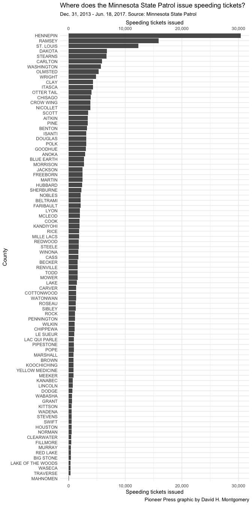

But if you adjust for each county's population, the seven metro counties are all at the bottom of the list. Leading the charge with nearly twice as many speeding tickets as any other county? Cook, sandwiched between Lake Superior and Canada in the far northeastern part of the state.

``` r
source("https://raw.githubusercontent.com/pioneerpress/code/master/lookups/mncountypop.r", echo = FALSE, verbose = FALSE) # Load a script with up-to-date MN county populations
mncountypop$county <- gsub("Saint ", "St. ", mncountypop$county) # Get St. Louis County into the right format to match
# Group speeding ticket data by county, and match it with county populations
speeding.counties <- speeding %>% # Start with the speeding dataset
    group_by(violation_county) %>% # Group by county
    summarize(tickets = n()) %>% # Summarize the number of tickets in each county
    left_join( # Join that dataset with our county population
        mncountypop %>%
            mutate(county = toupper(county)) %>% # Formatting county names to upper case to match
            select(county, pop), # Selecting only the columns we need
        by = c("violation_county" = "county")) %>% # Setting the columns to match by
    mutate(tickets.percap = tickets/pop) # Calculating tickets per capita

# Plot it
ggplot(speeding.counties, aes(fct_reorder(violation_county, tickets.percap), tickets.percap)) +
    geom_col() +
    coord_flip() + # Swap the X and Y axes
    theme_minimal() +
    scale_y_continuous(sec.axis = sec_axis(~ . * 1, name = "Speeding tickets issued per resident")) +
    labs(title = "Where does the Minnesota State Patrol issue speeding tickets?",
         subtitle = paste0(
             strftime(min(speeding$datetime), format = "%b. %e, %Y"),
             " - ",
             strftime(max(speeding$datetime), format = "%b. %e, %Y"),
             ". Source: Minnesota State Patrol"
             ),
         caption = "Pioneer Press graphic by David H. Montgomery",
         x = "County",
         y = "Speeding tickets issued per resident")
```

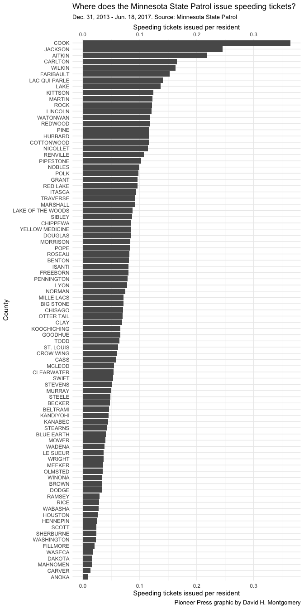

Here's what that looks like on a map:

``` r
mncounties <- readOGR(dsn = "mn counties", layer = "county", verbose = FALSE) # Load the county data
unzip("stateth.zip") # Unzip the trunk highway data
trunkhwy <- readOGR(dsn = ".", layer = "TH07252013", verbose = FALSE) # Load the trunk highway map
# Clean up the county names so they'll match
mncounties@data$COUNTYNAME <- gsub("Saint ","St. ",mncounties@data$COUNTYNAME)
mncounties@data$COUNTYNAME <- toupper(mncounties@data$COUNTYNAME)

# Do some annoying data crunching ggmap requires before graphing. 
mncounties@data$id <- rownames(mncounties@data)
mncounties.f <- fortify(mncounties)
mncounties.f <- left_join(mncounties.f, mncounties@data %>% select(COUNTYNAME, id), by = "id")
mncounties.f <- left_join(mncounties.f, speeding.counties, by = c("COUNTYNAME" = "violation_county"))
trunkhwy <- readOGR(dsn = path.expand("~/Dropbox/Sharing Folder/Maps/stateth"), layer = "TH07252013", verbose = FALSE)
trunkhwy@data$id <- rownames(trunkhwy@data)
trunkhwy.f <- fortify(trunkhwy) %>% left_join(trunkhwy@data, by = "id")
```

``` r
# Plot the map
ggplot(mncounties.f, aes(x=long, y=lat, group=group)) +
    geom_polygon(aes(fill = tickets.percap), color="white", lwd=0.2) + # Map counties, shaded by tickets per capita
    geom_polygon(data = trunkhwy.f, lwd = 0.2, color = "black", alpha = 0.5) + # Map trunk highways
    theme_nothing(legend=TRUE) + # Remove map cruft
    scale_fill_distiller(name= "Tickets per capita", palette="PuBu", direction = 1) + # Apply a color scale
    labs(title = "Where does the Minnesota State Patrol issue speeding tickets?",
         subtitle = paste0(
             strftime(min(speeding$datetime), format = "%b. %e, %Y"),
             " - ",
             strftime(max(speeding$datetime), format = "%b. %e, %Y"),
             ". Source: Minnesota State Patrol"
             ),
         caption = "Pioneer Press map by David H. Montgomery")
```

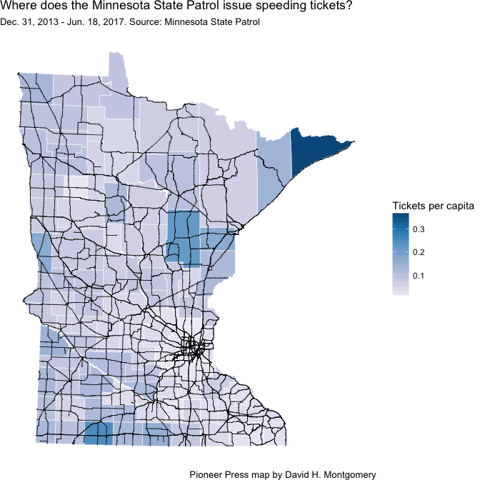

Looking at Cook
---------------

There doesn't appear to be any major change of time in Cook County's rash of speeding tickets. (It's not, for example, a factor of a single summer of amped-up enforcement.)

``` r
cook <- speeding %>% filter(violation_county == "COOK") # Filter down to just Cook County
# Plot Cook County speeding tickets over time
ggplot(cook %>% group_by(year = format(datetime, "%Y"), month = format(datetime, "%m")) %>% summarize(tickets = n()) %>% mutate(yearmon = as_date(paste0(year,"-",month,"-01"))), aes(yearmon, tickets)) +
    geom_col() +
    geom_smooth() +
    scale_y_continuous(labels = comma) +
    scale_x_date(date_breaks = "3 months", date_labels = "%b. %y") +
    theme_minimal() +
    labs(title = "Speeding tickets issued by month in Cook County MN by State Patrol",
         subtitle = paste0(
             strftime(min(speeding$datetime, na.rm = TRUE), format = "%b. %e, %Y"),
             " - ",
             strftime(max(speeding$datetime, na.rm = TRUE), format = "%b. %e, %Y"),
             ". Source: Minnesota State Patrol"
             ),
         caption = "Pioneer Press graphic by David H. Montgomery",
         x = "Month",
         y = "Speeding tickets issued")
```

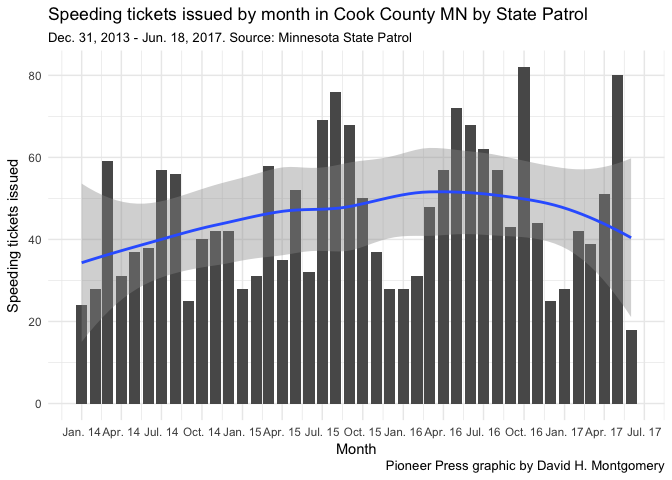

More than hald of Cook County's tickets are issued in West Cook, the vast unorganized township that occupies the northwest and central parts of the sparsely populated county.

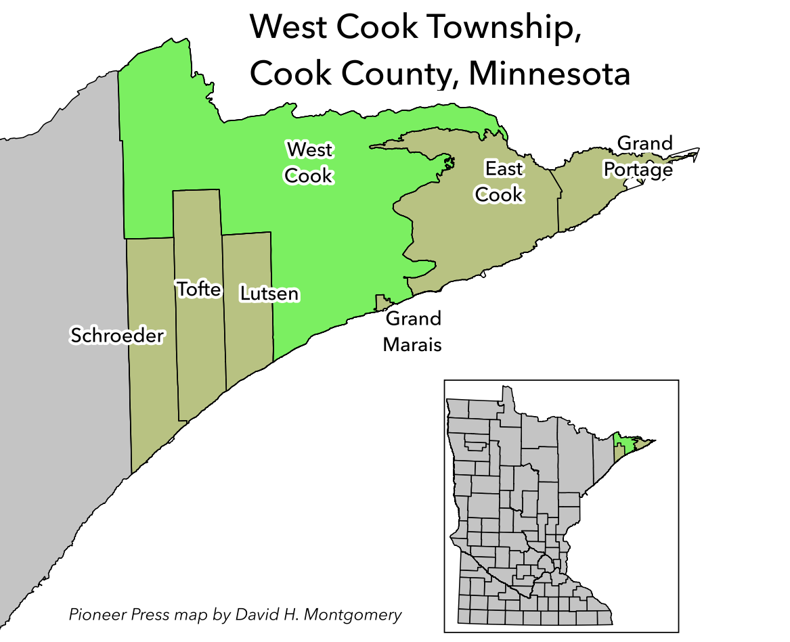

In particular these are almost all on Minnesota Highway 61, the main highway running along Lake Superior to the Canadian border.

The area in question starts near a store called Silver Creek Gifts and a resort called Schweitz's Retreat, about four miles northeast of Two Harbors. It runs northeast for 17.3 miles, ending just past Split Rock Lighthouse State Park, a few miles shy of Beaver Bay and Silver Bay. This one stretch of highway is 55 mph all the way, and has around 1,000 speeding tickets over the past four and a half years, with an average of 13.3 mph over the limit.
